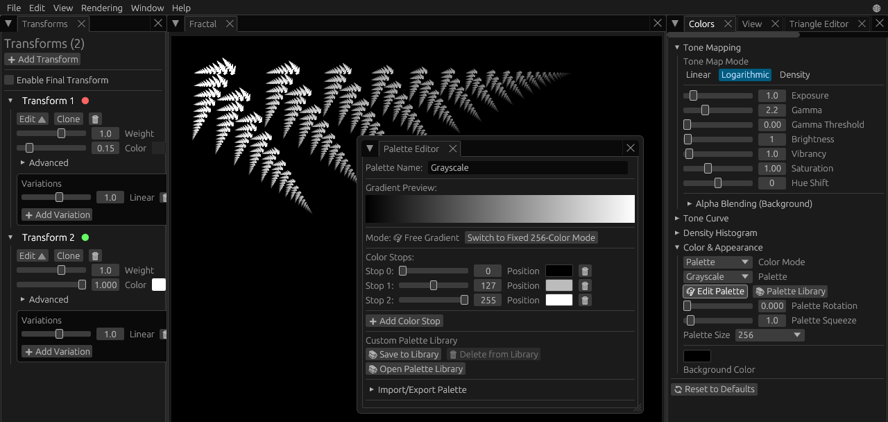
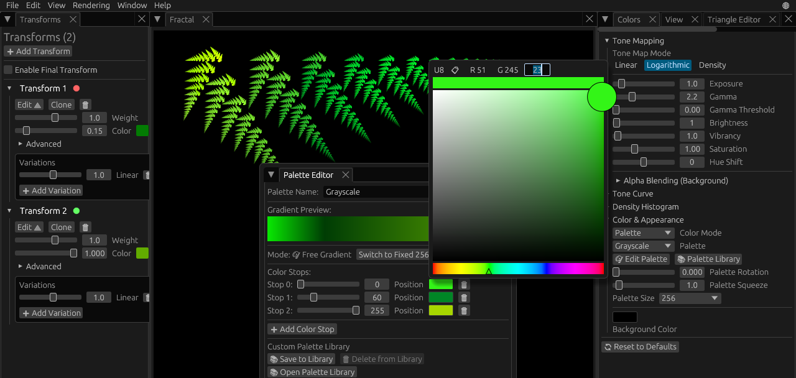

# Colors and Tone Mapping

Fractals have infinite detail, but representing this detail as colors on a screen can be tricky. 

Each iteration of the fractal draws a single pixel, and each pixel is represented by two values, **density** and **color**. Density refers to how many iterations have "hit" a specific pixel. Areas with low density are mostly transparent, so they blend the pixel's color with the background. Areas with higher density are fully opaque, no transparency, and they use the full color value.

In general, high density areas of the fractal are brighter, while lower density areas are darker. However, this depends on the palette, the background color, and other settings.

If you want a good looking fractal, proper tone mapping is essential and **tone mapping** is all about how to apply colors to different densities. If you've got interesting detail in lower density areas, you don't want it to get too dark. Similarly, if you've got interesting details in high density areas, you don't want those areas to be too bright.

## Palettes

I'm going to start with the fractal we created in the [first tutorial](understanding-fractal-flames.md), but you can use whatever fractal you want.

We made a fractal that's shaped like a fern, so let's create a new palette to make it different shades of green. A **palette** is exactly what it sounds like, a collection of different colors used to "paint" the fractal.

First, you want to make sure you've got the Colors panel open on the right. If you don't see the Colors tab, it can be opened through top Menu under Window.

In the Color & Appearance section, confirm you've got Palette selected as the Color Mode. Then select "Greyscale" from the Palette dropdown just below, and Edit Palette.

It's a simple gradient, black at one end, white at the other, with a grey "color stop" in between. Colors in the palette are represented by **color stops**, which don't just store the color but also the position in the palette. Position 0 is the very beginning, position 255 is the very end, position 127 is halfway between.

Let's set the first color stop to a nice green. First, click the colored rectangle to the right of "Position" to bring up the color selector. Slide the rainbow bar on the bottom to green, and then pick a color in the top right of the box for a well saturated green. You can also edit the RGB values directly at the top, I've set the color to (R 51, G 245, B 23).

Similar to before, but with the second color stop. Let's choose a darker green this time, I'm using (R 0, G 134, B 38). With the third and final color stop, set the color to a yellowish-green, I picked (R 167, G 214, B 0).

## Palette Library

If you don't want to create your own palette, FAR has hundreds of pre-made ones to choose from. You can open the **Palette Library** from the top Menu under Window, and there's also a button in the Colors panel.

Click the checkbox to enable/disable a pack, and choose a palette to apply to your fractal. You can also use the **Palette Rotation** slider to "rotate" the palette, changing which parts of the palette are applied to the fractal.

## Tone Mapping

I mentioned before how mapping density properly is key to a good-looking fractal. Luckily, it's not much different than editing a photo. There's **Brightness**, which controls how bright dense areas are, **Exposure**, which controls overall exposure, and **Gamma**, which is related to contrast. All of these can be found under Tone Mapping in the Colors panel.

If you're used to photo editing software, you may recognize the **Tone Curve** which can be used to fine-tune tone mapping even more.

The proper tone mapping settings depend on a number of factors, so it's hard to make rules about what's best. If you mess anything up, you can always use Undo or the **Reset to Defaults** button at the bottom of the Colors panel.

* Go Back - [FAR Tutorials](README.md)