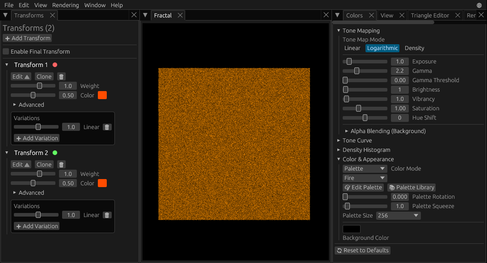
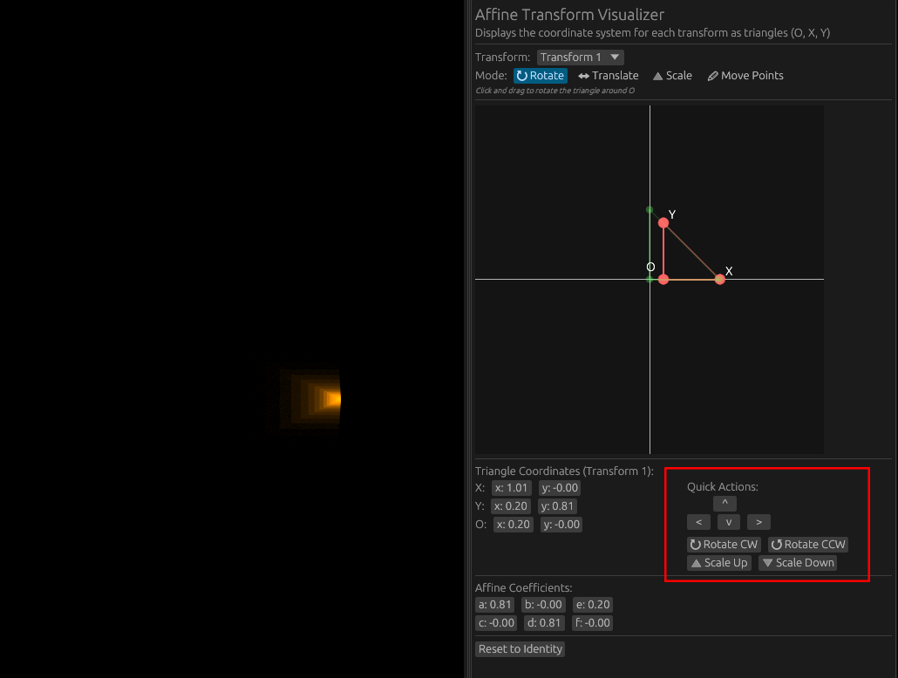
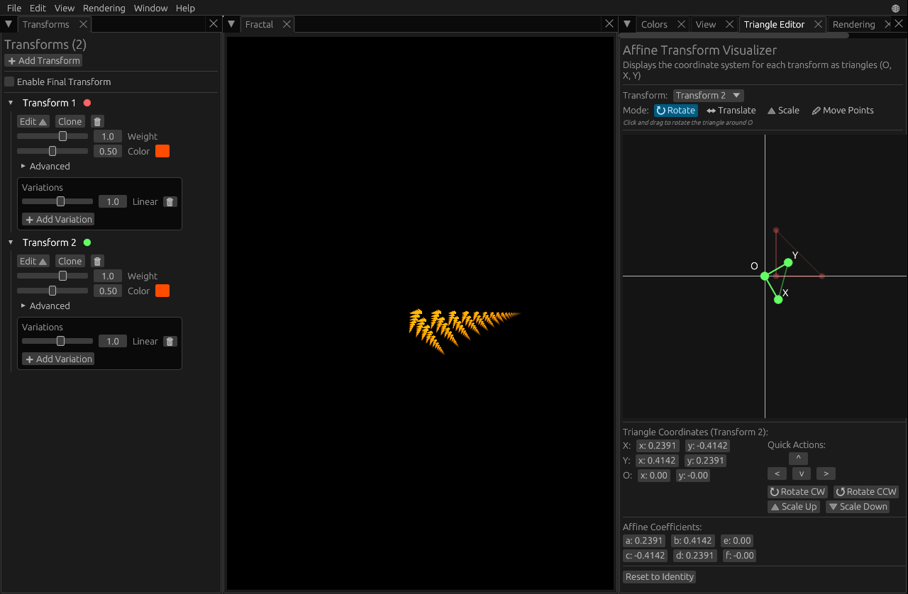
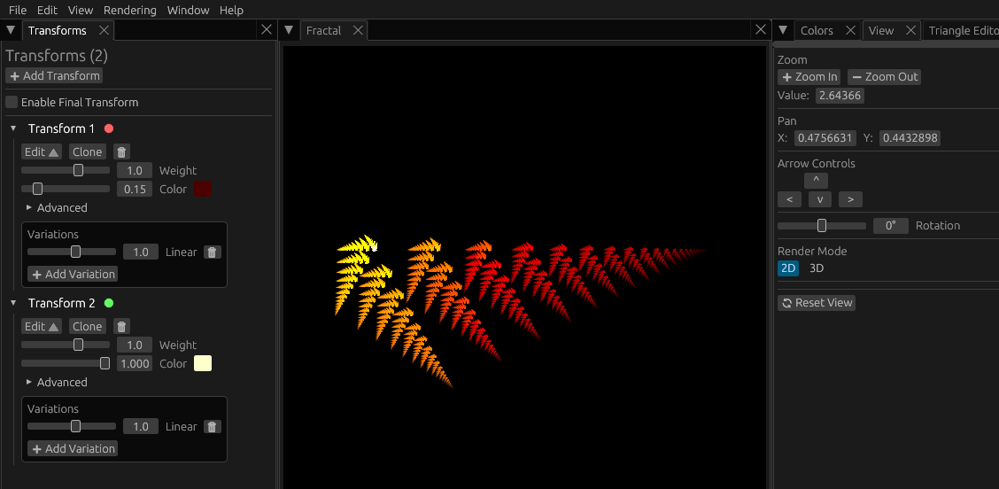
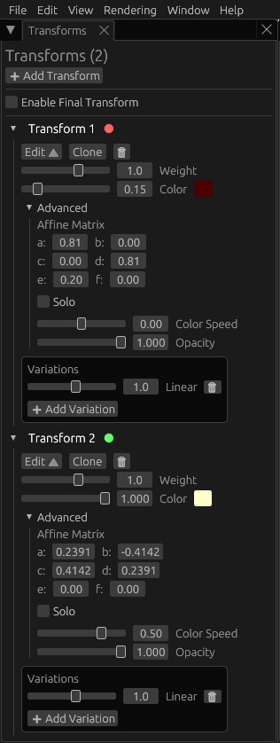

# Understanding Fractal Flames

At their core, Fractal Flames are made up of **Transforms**. I like to think of them as sort of like funhouse mirrors.

While a mirror normally reflects without any visible distortion, a [funhouse mirror](https://en.wikipedia.org/wiki/Distorting_mirror) can enlarge, shrink, stretch and skew the image. You can make it look wavy, or create a fish-eye effect. The Transforms in a Fractal Flame function in a similar manner.

It's called a "Transform" because it transforms the input in a certain way, and it does this via the Affine Coefficients and the Variations.

The **Affine Coefficients** are responsible for things like reflecting, rotating, scaling, shearing and translating.

The **Variations** are responsible for more complex functions, like the wave and fish-eye distortion mentioned above.

An [infinity mirror](https://en.wikipedia.org/wiki/Infinity_mirror) has two mirrors reflecting each other, the image bounces back and forth, and shrinks slightly with each reflection. You can create this same effect in fractal flames through a single Transform with its Affine Coefficients set to scale the image down on each "reflection".

A Fractal Flame repeats the same process over and over again, usually millions of times, and each time it's repeated that's called an **iteration**. The number of iterations performed is closely connected to the visual quality of the fractal produced.

That's enough theory for now, let's get started on actually making something.

## Creating a basic Fractal Flame

Load up FAR ([online version here](https://calibas.github.io/)).

In the top menu, select File and then New. This will create a new fractal with a single transform. 

Then click the **Add Transform** button at the top of the Transforms panel on the left. You should now have two Transforms with the default settings (see image below).

Now we're going to modify the transformation affines so we get something other than just a square. However, to make things easier, we're not going to modify the affine values directly. FAR has something called a **Triangle Editor**, which displays affines as colored triangles. 

Click the **Edit 🔺** button under Transform 1 in the Transforms panel on the left. This will open the Triangle Editor with Transform 1 selected.

In the **Quick Actions** below the triangles, click **>** twice to move the transform to the right 0.2. Then click **Scale Down** twice, each time will shrink the transform by 10%. The fractal should now look something like the image below.

Next, click the **Edit 🔺** button under Transform 2 in the Transforms panel to select Transform 2. In the **Quick Actions** click **Rotate CW** 4 times to rotate the triangle a total of 60 degrees. Then click **Scale Down** seven times. 

You should now see something like the image below: 

You can move the fractal around by dragging it with the mouse, or using the arrow keys. You can zoom with the mouse wheel, or the +/- keys. There's also the **View panel** with controls to zoom and move the view.

You can use this to explore the fractal a little bit, move the camera around until you like what you see. I centered the fractal, and zoomed in a little bit.

You'll notice the entire fractal is the same color, this is because the **Color** option for both Transforms is set to 0.5. The Color option is the position in the palette where each Transform gets its color from. A setting of 0.5 means the transform gets the color that's exactly halfway through the palette.

To make things more colorful, the Transforms need to use different position on the palette. In the Transforms Panel, go to the **Color slider** under Transform 1 and set it to 0.15. Then go to the **Color slider** under Transform 2 and set it to 1.0. See the image below for reference.

If you fractal doesn't look like the one above, you can copy over the following settings in the Transforms panel. To edit the transform affines, click **Advanced**:

And that completes this tutorial. You should now have a simple fractal that resembles a fern leaf.

* Continue - [Colors and Tone Mapping](colors-and-tonemapping.md)
* Go Back - [FAR Tutorials](README.md)